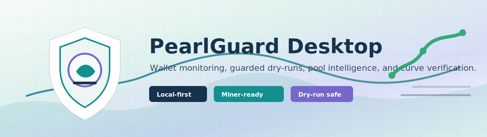

# PearlGuard Desktop

PearlGuard Desktop is a lightweight cross-platform desktop companion for Pearl Wallet monitoring, guarded dry-run sweeps, address history review, balance curve verification, and mining pool intelligence.

It is designed for local operators and miners who want a calmer operational dashboard without storing wallet passphrases or committing private runtime data.

## Status

PearlGuard Desktop is an early operator preview. The current application focuses on GUI workflows, local fixtures, dry-run safety checks, i18n, pool adapter scaffolding, and release automation.

## Features

- Cross-platform desktop shell for Windows, macOS, and Linux.
- Lightweight dependency profile: Electron main process with a dependency-light renderer.
- Internationalization for all UN official languages: Arabic, Chinese, English, French, Russian, and Spanish.
- Startup language selection from the operating system locale, with an in-app override.
- Dashboard for wallet health, sweep readiness, recent audit events, and pool intelligence.
- Miner-focused pool sync layer with Miningcore-style, Yiimp-style, NOMP-style, Zpool-style, and generic JSON adapters.
- Address history browsing with searchable observations.
- Balance curve verification with reserve and threshold guides.
- Dry-run sweep check that never broadcasts a transaction.
- Local-first privacy model with ignored runtime config, logs, audit databases, and CSV exports.
- Release workflow configured for GitHub Releases from this repository.

## Safety Model

- Wallet passphrases are never stored by this project.
- Transfer-capable workflows must be explicitly armed in future wallet integration releases.
- The current end-to-end test runs only in fixture and dry-run mode.
- Runtime logs, audit CSV files, local databases, wallet configs, and pool endpoint secrets are ignored by Git.
- Review all code and settings before using the project with real funds.

## Mining Pool Intelligence

PearlGuard includes a pool sync layer for mainstream mining-pool API styles. The public repository ships only safe example configuration and demo fixtures. Private pool endpoints, API keys, and wallet addresses belong in ignored local files.

Supported adapter families:

- `zpool-status`
- `yiimp-status`
- `miningcore-pool`
- `nomp-pool`
- `generic-json`

Copy `data/pools.example.json` to a local ignored config file before enabling real endpoints. Copy `data/wallet.config.example.json` to a local ignored wallet config before connecting a real wallet.

## Development

```powershell
npm install
npm run lint
npm test
npm run test:e2e
npm start
```

The end-to-end smoke test launches the desktop app with fixture pool data and dry-run transfer protection enabled.

## Release

The repository includes `.github/workflows/release.yml` for tagged releases:

```text
v0.1.0
```

The release workflow builds Windows, macOS, and Linux artifacts and publishes a draft GitHub Release for `stlin256/pearlguard-desktop`.

## Local Runtime Files

The following files are intentionally ignored:

```text
pools.local.json
wallet.config.json
addresses.local.json
*.csv
*.log
*.sqlite
*.local.json
```

Do not commit real wallet addresses, transaction ids, passphrases, pool API keys, local usernames, private paths, or runtime logs.

## Disclaimer

PearlGuard Desktop is not an official Pearl Wallet product. It can display cryptocurrency wallet and mining information, and future versions may include guarded transfer-capable workflows. Use it at your own risk.


